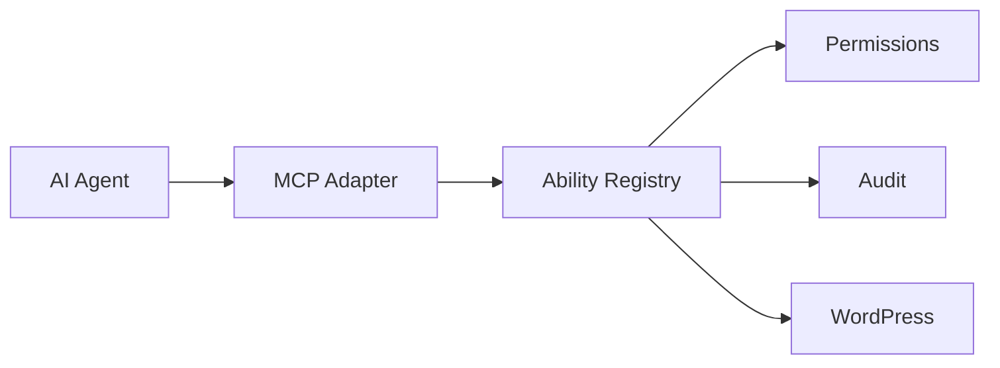

<div align="center">

# WordPress MCP Abilities

**Safe, explicit WordPress actions for AI agents over MCP.**

[](https://wordpress.org/)
[](https://www.php.net/)
[](https://github.com/ToniLopezPhoto/wordpress_mcp_abilities/actions)
[](https://github.com/ToniLopezPhoto/wordpress_mcp_abilities/releases/latest)
[](LICENSE)

**Catálogo de Abilities (285)** · **477 test cases** · **48 security tests**

</div>

---

## Contents

- [Overview](#overview)
- [Requirements](#requirements)
- [Installation](#installation)
- [First-run setup](#first-run-setup)
- [Abilities overview](#abilities-overview)
- [Security model](#security-model)
- [Upgrading and uninstalling](#upgrading-and-uninstalling)
- [Development](#development)
- [Releases and versioning](#releases-and-versioning)
- [Troubleshooting](#troubleshooting)
- [Roadmap](#roadmap)

## Overview

WordPress MCP Abilities is a WordPress plugin that registers a fixed catalog of *abilities* with the WordPress Abilities API and exposes them to AI agents through the official [WordPress MCP Adapter](https://github.com/WordPress/mcp-adapter). Instead of giving an agent a shell, a database connection or an administrator login, you give it a dedicated WordPress user and a set of narrowly defined operations. Each ability is:

- **explicit**: one ability per operation (`wp-mcp/create-post`, `wp-mcp/approve-comment`, ...), never a generic "execute anything" tool;
- **schema-bounded**: closed input and output schemas, validated before anything runs;
- **permission-aware**: checked against the native WordPress capabilities of the authenticated user, so an agent never does more than its WordPress role allows.



Every action is explicit, schema-bounded and checked against native WordPress capabilities.

## Requirements

| Requirement | Details |
|---|---|
| WordPress | 6.9 or newer (provides the Abilities API) |
| PHP | 7.4 or newer |
| MCP Adapter | The [MCP Adapter](https://github.com/WordPress/mcp-adapter) plugin, installed as `mcp-adapter` and active (declared through the plugin header `Requires Plugins`). CI tests against the release tag pinned in `.github/workflows/ci.yml` (`MCP_ADAPTER_REF`, currently `v0.6.1`). |
| HTTPS | WordPress only offers Application Passwords over HTTPS (or in a local environment) |
| MCP client | Any client that can reach the adapter endpoint with HTTP Basic authentication |

Optional: the official WordPress Importer plugin (for `wp-mcp/import-content`), and WooCommerce, Yoast SEO, Contact Form 7, Gravity Forms or WPForms if you want their adapter abilities.

## Installation

### From a release (recommended)

Install and activate **MCP Adapter** first. Then download two files from the [latest release](https://github.com/ToniLopezPhoto/wordpress_mcp_abilities/releases/latest): `wordpress-mcp-abilities-X.Y.Z.zip` and `wordpress-mcp-abilities-X.Y.Z.zip.sha256` (`X.Y.Z` is the release number, for example `0.16.0`).

Verify the download, with both files in the same folder:

```bash
sha256sum -c wordpress-mcp-abilities-X.Y.Z.zip.sha256    # macOS: shasum -a 256 -c ...
```

```powershell
# Windows PowerShell: the two values must be identical (case does not matter)
(Get-FileHash .\wordpress-mcp-abilities-X.Y.Z.zip -Algorithm SHA256).Hash
Get-Content .\wordpress-mcp-abilities-X.Y.Z.zip.sha256
```

Then install it any of these ways:

- **WP Admin**: Plugins > Add New > Upload Plugin > choose the zip > Activate.
- **WP-CLI**: `wp plugin install ./wordpress-mcp-abilities-X.Y.Z.zip --activate`
- **Manually**: unzip into `wp-content/plugins/` (the archive contains a single `wordpress-mcp-abilities/` folder) and activate the plugin from the Plugins screen.

The zip contains only the plugin runtime (main file, `includes/`, `uninstall.php`, `README.md`). The checksum detects corrupted or altered downloads; releases are not signed (see [`SECURITY.md`](SECURITY.md#verifying-downloads)).

### From source

The repository root is not an installable plugin: only the [`wordpress-mcp-abilities/`](wordpress-mcp-abilities/) folder is. To try unreleased code, place that folder in `wp-content/plugins/`, or build the same zip a release uses (see [`docs/RELEASING.md`](docs/RELEASING.md)).

## First-run setup

Activation creates one thing: the **`wp_mcp_agent`** role (displayed as *WordPress MCP Agent*) with the capabilities `read`, `edit_posts`, `edit_published_posts` and `publish_posts`. It does not create a user or a credential.

1. **Create the agent user.** Users > Add New, for example username `wp-mcp-agent`, role *WordPress MCP Agent*.
2. **Create an Application Password.** Users > edit that user > Application Passwords > enter a name > *Add New Application Password*. Copy it immediately; WordPress shows it once. Revoke it from the same screen at any time.
3. **Point your MCP client at the endpoint** and authenticate with HTTP Basic (the agent's username plus the Application Password, never its login password):

```http
POST https://your-site.example/wp-json/mcp/mcp-adapter-default-server
```

Example client configuration (Claude Desktop style) using the [`@automattic/mcp-wordpress-remote`](https://www.npmjs.com/package/@automattic/mcp-wordpress-remote) proxy, which bridges a local MCP client to the adapter endpoint. Any MCP client that can send HTTP Basic credentials to the endpoint works too; use its own configuration format.

```json
{
  "mcpServers": {
    "wordpress": {
      "command": "npx",
      "args": ["-y", "@automattic/mcp-wordpress-remote"],
      "env": {
        "WP_API_URL": "https://your-site.example/wp-json/mcp/mcp-adapter-default-server",
        "WP_API_USERNAME": "wp-mcp-agent",
        "WP_API_PASSWORD": "xxxx xxxx xxxx xxxx xxxx xxxx"
      }
    }
  }
}
```

The proxy is a third-party package (not part of this project): review it and pin a version you trust before using it with a site you care about.

The adapter's default server publishes three tools, and abilities are found and run through them: `mcp-adapter-discover-abilities` (lists the `wp-mcp/*` abilities), `mcp-adapter-get-ability-info` (schema of one ability) and `mcp-adapter-execute-ability`. Calling `wp-mcp/get-current-user` is a quick way to confirm which identity the agent runs as.

**Choose the role deliberately.** The default role is intentionally small. It has no `delete_posts`, `edit_others_posts` or `upload_files`, so trashing, deleting or reassigning content, uploading media and all administrative abilities are refused with a permission error (for example `wp_mcp_permission_denied` or `wp_mcp_ownership_violation`) until you give the user a role that holds the needed capabilities. The plugin never widens the role for you, and its role abilities refuse to modify `wp_mcp_agent`. Prefer a custom role with only the capabilities you need over an Administrator account.

## Abilities overview

285 abilities across 15 categories. Counts come from `WP_MCP_Ability_Matrix`, the single source of truth; the full reference (inputs, outputs, annotations, required capabilities, error codes) lives in [`wordpress-mcp-abilities/README.md`](wordpress-mcp-abilities/README.md), with section numbers below.

| Area | Abilities | What an agent can do | Reference |
|---|---:|---|---|
| Content: posts and pages | 38 | CRUD, publish, unpublish, schedule, trash, restore, permanent delete, author, slug, sticky, password, page attributes, revisions, autosave, duplicate, bulk trash | 4a-4i |
| Custom post types | 20 | Discover registered types, then CRUD, lifecycle, revisions, featured image and registered post meta; the set is fixed and does not grow with the site's types | 4t |
| Media | 15 | Upload (base64 or SSRF-checked URL), metadata, replace, attach, featured image, regenerate, trash, restore, delete, bulk trash | 4j |
| Taxonomies | 16 | Categories, tags and custom taxonomies: terms CRUD, assign and remove, bulk, registered term meta | 4k |
| Comments | 13 | List, create, reply, edit, moderate (approve, spam, trash), permanent delete, bulk moderation | 4l |
| Users, roles, Application Passwords | 22 | Profiles, roles and capabilities, user creation and deletion (with reassignment), Application Passwords | 4m |
| Navigation | 11 | Classic menus, locations and menu items | 4n |
| Site editor | 22 | Templates, template parts, patterns, synced patterns, navigation blocks, global styles, widget areas (read) | 4o |
| Plugins | 11 | List, install from repository or URL, activate, deactivate, update, auto-updates, delete | 4p |
| Themes | 10 | List, install from repository or URL, switch, update, auto-updates, delete | 4q |
| Settings | 18 | General, Writing, Reading, Discussion, Media, Permalinks and Privacy settings through a per-field allowlist, rewrite flush, settings export and import | 4s, 4u |
| System, updates, cron, maintenance, import/export | 25 | Site and environment info, Site Health, core and translation updates, cron events, cache and transient cleanup, maintenance mode, content export and import | 4r, 4u |
| Privacy | 8 | Personal data export and erasure requests | 4u |
| Multisite | 30 | Network sites, network users and memberships, network plugins and themes, network settings; registered but unsupported on a single site | 4v |
| Integrations | 17 | Two framework abilities plus 15 adapter operations that register only when the plugin is active: WooCommerce (7), Yoast SEO (2), Contact Form 7 (2), Gravity Forms (2), WPForms (2) | 4w |
| Discovery | 9 | Read-only: global search, post statuses, MIME types, block types, pattern categories, template types, the caller's capabilities, feature support | 4x |
| **Total** | **285** | | |

## Security model

Security boundaries are part of the public API. To report a problem, see [`SECURITY.md`](SECURITY.md).

- **Capability-checked.** Every ability runs as the authenticated WordPress user. Mutations re-check the per-object meta-capabilities (`edit_post`, `delete_post`, `read_post`, ...) inside the callback, with no hard-coded "author equals current user" shortcut: an Editor may act on others' content exactly as in wp-admin, the default agent role may not.
- **Ownership is real.** Reassigning authors, sticking posts or editing others' content needs the capabilities WordPress itself requires (for example `edit_others_posts`).
- **Closed schemas.** Input and output schemas are closed (`additionalProperties: false`), inputs are validated before any work, and fields the server must decide are not accepted as input (enforced by a registry-wide test).
- **Explicit allowlists.** Settings are addressed by a field from a fixed per-group vocabulary, never by raw option name. User profile fields, media metadata, term and post metadata (registered, REST-visible keys only) and Site Health tests are fixed sets; cron scheduling is limited by a permanent hook denylist and to hooks with a registered listener.
- **SSRF-aware remote URLs.** `upload-media-from-url` and the plugin and theme `install-*-from-url` abilities use `wp_safe_remote_get`, accept HTTP(S) only, reject embedded credentials and fragments, refuse localhost and private or reserved addresses, and limit redirects, timeouts and response size. Media uploads also accept explicit host allow and deny lists.
- **Bounded by construction.** Pagination is capped at 50 items per page, bulk operations at 20 items (reported item by item), decoded base64 uploads at 10 MiB and plugin or theme downloads at 50 MB.
- **Secrets stay put.** Password hashes and authentication material are never returned, a new Application Password is returned once by the call that creates it, responses never contain server file paths, and discovery answers with identifiers, booleans and counts only.
- **MCP-only surface.** Abilities are flagged for MCP (`meta.mcp.public`) and are not exposed through additional REST routes (`show_in_rest` is false).
- **Labelled and separated destructive actions.** Every ability carries `destructive` and `idempotent` annotations; trash and permanent delete are distinct abilities; installing a plugin or theme never activates or switches to it; deleting an active plugin or theme is refused.
- **Audit trail.** Every write fires the `wp_mcp_audit_log` action (timestamp, user, ability, object type and ID, result, error code); credential-shaped keys are dropped and values truncated. Define `WP_MCP_AUDIT_LOG` as `true` in `wp-config.php` to also write one line per event to the PHP error log.

**Deliberately not exposed:** arbitrary PHP, SQL, shell or WP-CLI execution; generic filesystem access (including the plugin and theme file editors); generic option or metadata read/write; any generic function, hook, REST-route or option bridge into WordPress or a third-party plugin; granting or revoking Super Admin; moving a network site to another domain; database repair; settings that hold secrets or site URLs. Integration adapters also exclude customer personal data and the credentials of the plugin they wrap.

**Not provided:** rate limiting or request throttling (add it in front of the endpoint, for example at the web server) and persistent audit storage (hook `wp_mcp_audit_log` to keep events). Authentication and privilege are WordPress's own: Application Passwords, roles and capabilities.

## Upgrading and uninstalling

There is no in-dashboard update notification (see [Releases and versioning](#releases-and-versioning)); watch the repository's Releases and read [`CHANGELOG.md`](CHANGELOG.md) before upgrading.

1. Back up the site.
2. Download the new release zip and verify its checksum, as in [Installation](#installation).
3. Deactivate the plugin (data is preserved), replace it with the new version (upload the zip, or `wp plugin install ./wordpress-mcp-abilities-X.Y.Z.zip --force`) and activate it.
4. If the role definition changed between versions, it is reconciled automatically on the next admin page load. Users and Application Passwords are not touched.

To roll back, deactivate, delete the plugin files, install the previous release zip and activate it.

**Deactivating** keeps the role and all data. **Deleting** the plugin from WP Admin runs `uninstall.php`, which removes the `wp_mcp_agent` role only if no user still has it, deletes the `wp_mcp_role_version` option, and never deletes users. Content and settings an agent changed are ordinary WordPress data and stay. Before deleting, remove the agent user or revoke its Application Passwords. If users still hold the role, reassign them and then run `wp role delete wp_mcp_agent`.

## Development

```bash
composer install          # dev tooling (PHPUnit, PHPCS/WPCS, PHPStan)
composer lint             # php -l on every PHP file
composer phpcs            # WordPress-Extra coding standards + PHP 7.4 compatibility
composer stan             # PHPStan level 5 with WordPress stubs
composer test             # unit suites (needs the WordPress test library and a database)
composer test:multisite   # network domain on a real multisite install
composer test:e2e         # real JSON-RPC requests through MCP Adapter
vendor/bin/phpunit --configuration phpunit.docs.xml.dist   # documentation drift, PHP only
```

`bin/install-wp-tests.sh <db-name> <db-user> <db-pass> [db-host] [wp-version]` installs the WordPress test library; [`.github/workflows/ci.yml`](.github/workflows/ci.yml) is the reference environment, including how the E2E job installs MCP Adapter with its Composer dependencies.

| Suite | Scope |
|---|---|
| Unit (`composer test`) | `test-abilities.php` (per-domain behaviour), `test-security.php` (cross-cutting threat model), `test-network.php` (skips itself on a single site) and `test-documentation.php` |
| Multisite | `test-network.php` against a real network |
| MCP Adapter E2E | `e2e-mcp-adapter.php`: initialize, `tools/list`, discovery and mutating workflows through the adapter's default server |
| Documentation drift | `test-documentation.php`: README ability, test and version numbers must match the code (see [`CONTRIBUTING.md`](CONTRIBUTING.md)) |

CI (`.github/workflows/ci.yml`) runs on pushes to `main` and on pull requests:

| Job | PHP | WordPress | Checks |
|---|---|---|---|
| Static analysis | 7.4, 8.3 | - | `php -l` and PHPCS on both; PHPStan on 8.3 |
| Unit tests | 7.4, 8.3 | 6.9, latest | PHPUnit on MariaDB 10.11; the `latest` legs are informational (`continue-on-error`) |
| Multisite tests | 8.3 | 6.9 | `composer test:multisite` |
| MCP Adapter E2E | 8.3 | 6.9 | `composer test:e2e` against the pinned adapter tag |
| Documentation drift | 8.3 | - | `phpunit.docs.xml.dist`, no WordPress needed |

Repository layout: `wordpress-mcp-abilities/` is the plugin (the only directory that ships in a release); `docs/`, `bin/`, `stubs/` and `.github/workflows/` hold documentation, test tooling and automation. Coding standards are in `phpcs.xml` and `phpstan.neon.dist`; tests are excluded from both. Read [`CONTRIBUTING.md`](CONTRIBUTING.md) before opening a pull request.

## Releases and versioning

- Versions follow [Semantic Versioning](https://semver.org/). While the major version is `0`, minor releases can include breaking changes to abilities; every change is recorded in [`CHANGELOG.md`](CHANGELOG.md).
- A release is an annotated tag `vX.Y.Z` on `main`. GitHub Actions checks the tag against the plugin header `Version`, builds the zip from the tagged commit with `git archive`, verifies it contains only the plugin runtime (no tests, no dotfiles), writes a SHA-256 checksum and publishes both files on the Releases page with the matching changelog section as release notes.
- Not provided: a WordPress.org listing, update notifications inside WordPress, signed releases or build attestations.
- Maintainers: the full checklist is in [`docs/RELEASING.md`](docs/RELEASING.md).

## Troubleshooting

| Symptom | Likely cause and fix |
|---|---|
| Admin notice "requires the MCP Adapter plugin to be installed and active", or no abilities served | Install and activate MCP Adapter; the plugin looks for `mcp-adapter/mcp-adapter.php`. If you installed the adapter from a source checkout rather than a packaged release, its Composer dependencies may be missing: run `composer install --no-dev` in its directory. |
| Admin notice "requires WordPress 6.9 or higher (Abilities API)" or "requires PHP 7.4" | Upgrade WordPress or PHP; below those versions the plugin registers nothing. |
| No *Application Passwords* section on the profile screen, or `wp_mcp_application_password_unavailable` | WordPress core enables Application Passwords only over HTTPS (or in a local environment), and a filter or security plugin can disable them. |
| HTTP 401 from the endpoint | The endpoint refuses anonymous requests. Send HTTP Basic with the agent's username and an Application Password, not its login password. |
| `wp_mcp_permission_denied` or `wp_mcp_ownership_violation` | The user's role lacks the capability the ability needs. The default agent role is deliberately limited; use a role that holds the capability. |
| The client lists three tools, not hundreds | By design: the default server exposes the three `mcp-adapter-*` meta-tools, and abilities are discovered and executed through them. |
| `wp_mcp_network_unsupported` (HTTP 501) | Network abilities need a multisite network (only `wp-mcp/get-network-info` answers on a single site). On a network each needs a concrete network capability; a site administrator holds none of them. |
| An integration ability (WooCommerce, Yoast SEO, ...) is missing | Adapter abilities register only while their plugin is active. `wp-mcp/list-integrations` (needs `activate_plugins`) reports `detected` and `covered` per integration. |
| `wp_mcp_remote_url_denied` | The URL failed the SSRF policy: HTTP(S) only, no embedded credentials or fragments, no localhost or private addresses, and any `allowed_hosts` or `deny_hosts` you passed. |
| `wp_mcp_import_unsupported` | `wp-mcp/import-content` needs the official WordPress Importer plugin. |

The complete list of error codes is in [`wordpress-mcp-abilities/README.md`](wordpress-mcp-abilities/README.md).

## Roadmap

Limited to what the project documentation already states:

- **More integration adapters.** Popular plugins in the SEO, forms, events, membership, mail, security, cache and analytics categories are detected (`wp-mcp/list-integrations` reports `covered: false`) but expose no abilities yet. Which operations deserve one is decided plugin by plugin; nothing is exposed by default.
- **Term merge and move** stay out until WordPress offers a single capability-safe API for them; explicit parent changes are available today.
- **Database repair and optimize** are not implemented: WordPress has no capability-safe API for them.
- **Never:** arbitrary PHP or SQL execution, generic option access or generic filesystem access, in any future domain.

---

<sub>Reusable plugin code only — keep production URLs, credentials, user data and deployment-specific configuration out of the repository.</sub>

**GPL-2.0-or-later**
