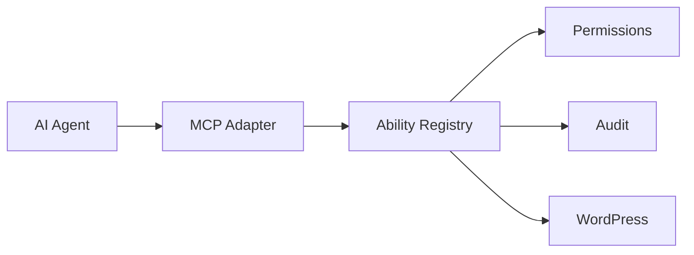

<div align="center">

# WordPress MCP Abilities

**Safe, explicit WordPress actions for AI agents over MCP.**

[](https://wordpress.org/)
[](https://www.php.net/)
[](https://github.com/ToniLopezPhoto/wordpress_mcp_abilities/actions)
[](LICENSE)

**Catálogo de Abilities (285)** · **477 test cases** · **48 security tests**

</div>

---

## How it works



Every action is explicit, schema-bounded and checked against native WordPress capabilities.

## Surface

`content` · `media` · `taxonomies` · `comments` · `users` · `navigation` · `site editor` · `plugins` · `themes` · `settings` · `multisite` · `integrations` · `discovery`

### Security by design

- Least privilege & ownership checks
- Closed input/output schemas
- Explicit allowlists
- SSRF-aware remote URL validation
- Bounded discovery and pagination
- Auditable destructive operations

> No arbitrary PHP, SQL, shell, filesystem access or generic WordPress option read/write.

## Use it

Requires **WordPress 6.9+**, **PHP 7.4+** and the official [WordPress MCP Adapter](https://github.com/WordPress/mcp-adapter).

```bash
composer install
composer test
composer stan
vendor/bin/phpcs
```

For the full ability reference, schemas and security notes, see [`wordpress-mcp-abilities/README.md`](wordpress-mcp-abilities/README.md).

---

<sub>Reusable plugin code only — keep production URLs, credentials, user data and deployment-specific configuration out of the repository.</sub>

**GPL-2.0-or-later**
